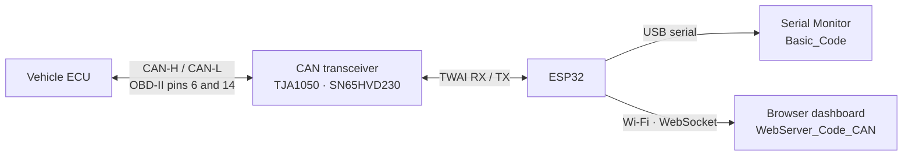

<div align="center">



# OBD2 CAN Bus Reader

**Open-source ESP32 scan tool for CAN bus vehicles.**<br>
Ready-to-flash firmware that reads live sensor data, trouble codes, freeze-frame data and the VIN over ISO 15765-4 and shows them on a web dashboard in your phone's browser — no ELM327, no app.

[](https://github.com/muki01/OBD2_CAN_Bus_Reader/stargazers)
[](https://github.com/muki01/OBD2_CAN_Bus_Reader/forks)
[](https://github.com/muki01/OBD2_CAN_Bus_Reader/issues)
[](LICENSE)
[](https://github.com/muki01/OBD2_CAN_Bus_Reader/commits/main)


[Features](#-features) ·
[Dashboard](#-web-dashboard) ·
[How It Works](#-how-it-works) ·
[Hardware](#-hardware) ·
[Quick Start](#-quick-start) ·
[FAQ](#-faq)

</div>

---

## 🌟 About

**OBD2 CAN Bus Reader** turns an ESP32 and a CAN transceiver into a **DIY OBD-II scan tool** for vehicles that use the **CAN bus** — practically every car built since 2008, and many from 2003 onwards.

Plug it into the OBD-II port and you get real-time engine data, trouble codes, freeze-frame snapshots, the VIN and the battery voltage. The ESP32's built-in CAN controller does the work, so the hardware is a single transceiver chip.

It comes in two builds:

| Build | Best for | Output |
| :-- | :-- | :-- |
| 🌐 [`WebServer_Code_CAN`](WebServer_Code_CAN) | A standalone Wi-Fi scan tool | Mobile-friendly web dashboard over WebSocket, OTA updates |
| 🖥️ [`Basic_Code`](Basic_Code) | Quick tests, learning, porting | Serial Monitor |

## ✨ Features

**Diagnostics**
- 📊 Live sensor data (OBD-II Mode 01)
- ❄️ Freeze-frame data (Mode 02)
- ⚠️ Stored and pending trouble codes (Modes 03 and 07)
- 🧹 Clear trouble codes and reset the MIL (Mode 04)
- 🚙 VIN and calibration IDs (Mode 09)
- 🔋 Battery voltage monitor

**Protocol**
- 🔀 ISO 15765-4 with **11-bit and 29-bit** identifiers at **250 and 500 kbit/s**
- 🔍 Automatic protocol detection, or a fixed protocol chosen in the settings
- 🔁 Reconnects on its own when the link drops

**Platform**
- 📶 Wi-Fi **access point or station** mode
- ⬆️ **OTA updates** for the firmware and the web interface
- 💾 Settings stored on the device
- 🔔 Buzzer, LED and RGB status feedback

## 📱 Web Dashboard

<a href="https://github.com/muki01/OBD2-Diagnostic-UI">
  
</a>
<a href="https://github.com/muki01/OBD2-Diagnostic-UI">
  
</a>

The ESP32 hosts its own Wi-Fi network. Connect your phone, open **`192.168.4.1`**, and every diagnostic function is one tap away. It works on Android, iOS and desktop browsers.

> [!NOTE]
> The dashboard front-end is developed in its own repository: **[OBD2 Diagnostic UI](https://github.com/muki01/OBD2-Diagnostic-UI)**. A pre-built copy ships in [`WebServer_Code_CAN/data`](WebServer_Code_CAN/data).

## 🧭 How It Works



1. **Detect.** In `Automatic` mode the firmware tries the four ISO 15765-4 combinations — 11 or 29 bit identifiers at 250 or 500 kbit/s — and keeps the one the ECU answers on.
2. **Request.** Standard OBD-II requests are sent to the functional address (`7DF`, or `18DB33F1` with 29-bit identifiers).
3. **Decode.** Responses are converted to engineering units with the SAE J1979 formulas.
4. **Publish.** Values go to the Serial Monitor, or to the web dashboard as JSON over a WebSocket.

### Supported protocols

| Setting | Identifiers | Bit rate |
| :-- | :-- | :-- |
| `11b250` | 11 bit | 250 kbit/s |
| `29b250` | 29 bit | 250 kbit/s |
| `11b500` | 11 bit | 500 kbit/s |
| `29b500` | 29 bit | 500 kbit/s |
| `Automatic` | Tries all of the above | — |

> [!IMPORTANT]
> **Does my car use CAN?** Look at the OBD-II socket. If **pins 6 and 14** have metal contacts, the car speaks CAN. Cars that only have **pin 7** use K-Line; for those, see **[OBD2 K-Line Reader](https://github.com/muki01/OBD2_K-line_Reader)**.

<table>
  <tr>
    <td width="50%"></td>
    <td width="50%"></td>
  </tr>
  <tr>
    <td align="center"><b>CAN bus</b> — pins 6 and 14</td>
    <td align="center"><b>K-Line</b> — pin 7</td>
  </tr>
</table>

## 🔧 Hardware

### What you need

| Part | Notes |
| :-- | :-- |
| ESP32 board | Developed and tested on the **ESP32-S3** |
| CAN transceiver | TJA1050, SN65HVD230 or similar |
| OBD-II male connector | Or a cut OBD-II extension cable |
| 12 V → 5 V regulator | To power the board from OBD-II pin 16 |
| *Optional* | Buzzer and LED for status feedback, 47 kΩ / 10 kΩ divider for the battery voltage |

### Schematic


| OBD-II pin | Signal | Connect to |
| :-: | :-- | :-- |
| **6** | CAN-H | Transceiver CANH |
| **14** | CAN-L | Transceiver CANL |
| **16** | Battery +12 V | Regulator input |
| **4 / 5** | Ground | Common GND |

### Default pins

| Function | GPIO |
| :-- | :-: |
| CAN RX | 12 |
| CAN TX | 13 |
| Status LED | 6 |
| Buzzer | 8 |
| Battery voltage (ADC) | 1 |
| RGB LED (WS2812) | 21 |

The TWAI driver accepts any free GPIO pair; change the pins at the top of the sketch.

### Custom PCBs


## 🚀 Quick Start

```bash
git clone https://github.com/muki01/OBD2_CAN_Bus_Reader.git
```

1. **Build the interface** from the [schematic](#schematic) and wire it to your ESP32.
2. **Choose a build:**
   - 🌐 **Web dashboard** — follow the [WebServer_Code_CAN setup guide](WebServer_Code_CAN/README.md).
   - 🖥️ **Serial Monitor** — open `Basic_Code/Basic_Code.ino`, select your ESP32 board and upload.
3. **Plug into the OBD-II port** and turn the ignition **on**.
4. **Web build:** join the Wi-Fi network **`OBD2 Master`** (password `12345678`) and open **http://192.168.4.1**.

> [!TIP]
> Change the access point password in `WEB_SERVER.ino` before you use the device regularly.

## 🗂️ Repository Structure

```text
OBD2_CAN_Bus_Reader/
├── WebServer_Code_CAN/    ESP32 firmware with Wi-Fi web dashboard and OTA updates
│   ├── data/              Web interface (upload to SPIFFS)
│   └── README.md          Setup guide
├── Basic_Code/            Serial Monitor firmware
└── images/                Schematic and connector photos
```

## ❓ FAQ

<details>
<summary><b>Which cars are supported?</b></summary>

Any vehicle whose engine ECU answers generic OBD-II requests over ISO 15765-4. CAN has been mandatory in the United States since model year 2008 and is used by practically all newer cars. Check that pins 6 and 14 of your OBD-II socket are populated.
</details>

<details>
<summary><b>Does it replace an ELM327? Does it work with Torque or Car Scanner?</b></summary>

It replaces the ELM327 for CAN bus vehicles, but it does not emulate the ELM327 AT command set, so third-party ELM327 apps will not connect to it. It comes with its own web dashboard instead.
</details>

<details>
<summary><b>Can I use it with my K-Line car?</b></summary>

Not with this firmware. Use the sister project <a href="https://github.com/muki01/OBD2_K-line_Reader"><b>OBD2 K-Line Reader</b></a>, which shares the same web dashboard.
</details>

<details>
<summary><b>Do I need a termination resistor?</b></summary>

The vehicle's CAN bus is already terminated. Many transceiver breakout boards carry their own 120 Ω resistor; it is usually best removed or left unconnected when you plug into a car.
</details>

<details>
<summary><b>Can I build my own firmware on top of this?</b></summary>

Yes. The <a href="https://github.com/muki01/OBD2_CAN_Bus_Library"><b>OBD2 CAN Bus Library</b></a> wraps the same protocol in a clean Arduino API.
</details>

## 🤝 Contributing

Contributions are welcome — bug reports, tested vehicle reports, fixes and documentation improvements. Please read the **[Contributing Guide](CONTRIBUTING.md)** and the **[Code of Conduct](CODE_OF_CONDUCT.md)**.

**Tested it on your car?** Open a [vehicle report](https://github.com/muki01/OBD2_CAN_Bus_Reader/issues/new/choose) with the make, model and year. Real-world reports help everyone.

## 🔗 Related Projects

This firmware is part of a family of open-source automotive projects. They share the same hardware approach, so what you build for one carries over to the others.

<table>
  <tr>
    <th colspan="3" align="left">Firmware — flash it and use it</th>
  </tr>
  <tr>
    <td width="30%"><a href="https://github.com/muki01/BMW_IBus_KBus"><b>BMW I-Bus / K-Bus Firmware</b></a></td>
    <td>Phone control and key-fob light functions for the BMW E46, on the ESP32 and Arduino.</td>
    <td width="96" align="center"><a href="https://github.com/muki01/BMW_IBus_KBus/stargazers"></a></td>
  </tr>
  <tr>
    <td width="30%"><a href="https://github.com/muki01/OBD2_K-line_Reader"><b>OBD2 K-Line Reader</b></a></td>
    <td>Scan tool for K-Line cars (ISO 9141-2, KWP2000) with a web dashboard, for the ESP32, ESP8266 and Arduino.</td>
    <td width="96" align="center"><a href="https://github.com/muki01/OBD2_K-line_Reader/stargazers"></a></td>
  </tr>
  <tr>
    <td width="30%"><b>OBD2 CAN Bus Reader</b><br><sub>you are here</sub></td>
    <td>Scan tool for CAN bus cars (ISO 15765-4) with the same web dashboard, for the ESP32.</td>
    <td width="96" align="center"><a href="https://github.com/muki01/OBD2_CAN_Bus_Reader/stargazers"></a></td>
  </tr>
  <tr>
    <td width="30%"><a href="https://github.com/muki01/VAG_KW1281"><b>VAG KW1281</b></a></td>
    <td>KW1281 diagnostics for VW, Audi, Škoda and SEAT: ECU information, measuring groups and fault codes.</td>
    <td width="96" align="center"><a href="https://github.com/muki01/VAG_KW1281/stargazers"></a></td>
  </tr>
  <tr>
    <th colspan="3" align="left">Libraries — build your own firmware</th>
  </tr>
  <tr>
    <td width="30%"><a href="https://github.com/muki01/BMW_IBus_KBus_Library"><b>BMW IBus KBus Library</b></a></td>
    <td>Receives, checks and sends BMW I-Bus and K-Bus messages; the library behind the BMW firmware.</td>
    <td width="96" align="center"><a href="https://github.com/muki01/BMW_IBus_KBus_Library/stargazers"></a></td>
  </tr>
  <tr>
    <td width="30%"><a href="https://github.com/muki01/OBD2_KLine_Library"><b>OBD2 K-Line Library</b></a></td>
    <td>K-Line diagnostics behind one API: ISO 9141-2, KWP2000, KW1281, DS2 and KW82.</td>
    <td width="96" align="center"><a href="https://github.com/muki01/OBD2_KLine_Library/stargazers"></a></td>
  </tr>
  <tr>
    <td width="30%"><a href="https://github.com/muki01/OBD2_CAN_Bus_Library"><b>OBD2 CAN Bus Library</b></a></td>
    <td>OBD-II diagnostics over ISO 15765-4 with the ESP32's built-in CAN controller.</td>
    <td width="96" align="center"><a href="https://github.com/muki01/OBD2_CAN_Bus_Library/stargazers"></a></td>
  </tr>
  <tr>
    <th colspan="3" align="left">Interface</th>
  </tr>
  <tr>
    <td width="30%"><a href="https://github.com/muki01/OBD2-Diagnostic-UI"><b>OBD2 Diagnostic UI</b></a></td>
    <td>The web dashboard used by the two OBD2 readers.</td>
    <td width="96" align="center"><a href="https://github.com/muki01/OBD2-Diagnostic-UI/stargazers"></a></td>
  </tr>
</table>

## 💼 Custom Development

I design automotive diagnostic tools, firmware and hardware professionally. Whether you need a complete product or only the communication layer, I can help.

| Service | Details |
| :-- | :-- |
| **Protocol implementation** | BMW I/K-Bus, K-Line (ISO 9141-2 / KWP2000), CAN / UDS, VAG KW1281 and other manufacturer-specific protocols |
| **ECU communication & reverse engineering** | Bus sniffing, packet decoding, module control, undocumented ECUs and buses |
| **ECU security access** | Seed-key algorithms and unlock routines for KWP2000 / UDS |
| **Embedded firmware** | Arduino, ESP32, ESP8266, STM32, Raspberry Pi Pico |
| **Custom hardware** | Diagnostic dongles, shields and PCBs designed to your requirements |
| **Companion apps** | Android, iOS and web apps to visualise, log and control your device |

Have a project in mind? Reach out through the [Contact](#-contact) section below.

## 📬 Contact

For custom development, collaboration, sponsorship or ready-made devices:

| Channel | Address |
| :-- | :-- |
| 📧 **Email** | [muksin.muksin04@gmail.com](mailto:muksin.muksin04@gmail.com) |
| 💼 **LinkedIn** | [linkedin.com/in/muksin-muksin](https://www.linkedin.com/in/muksin-muksin/) |
| 🐙 **GitHub** | [@muki01](https://github.com/muki01) |

## ☕ Support the Project

[](https://www.buymeacoffee.com/muki01)
[](https://www.paypal.com/donate/?hosted_button_id=SAAH5GHAH6T72)
[](https://github.com/sponsors/muki01)

## ⚠️ Disclaimer

> [!WARNING]
> This is a hobby and educational project provided as is, without warranty. Connecting custom hardware to a vehicle carries risk. The author is not responsible for any damage to vehicles, ECUs or equipment. Never operate the device or look at the dashboard while driving.

## 📄 License

Released under the **[GNU General Public License v3.0](LICENSE)**.

- You are free to use, study, modify and share this firmware.
- If you distribute it — on its own or as part of a product or firmware — you must make the complete source available under the same license.

**Closed-source or commercial product?** A separate commercial license is available. Get in touch through the [Contact](#-contact) section.

Copyright © 2024–2026 Muksin Muksin.

---

<div align="center">

Created by [**Muki**](https://github.com/muki01) · If this project helped you, please give it a ⭐

</div>
